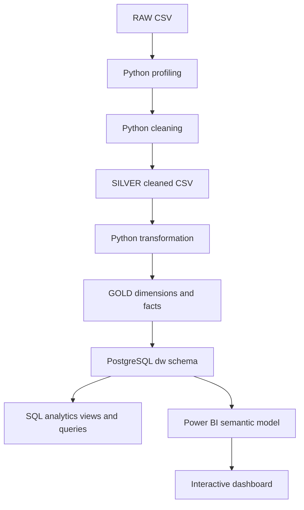
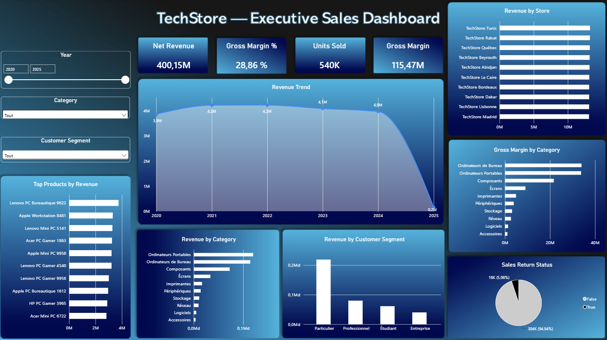
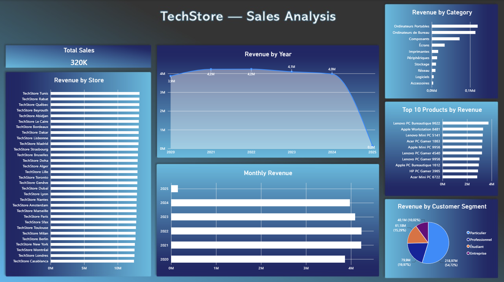
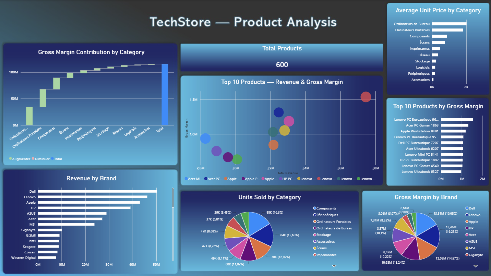
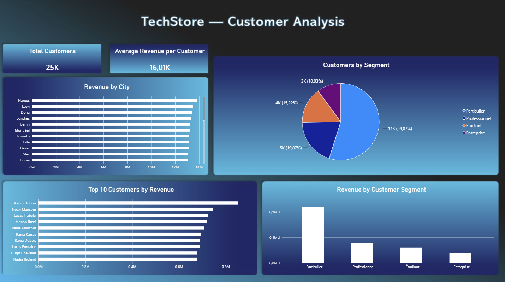
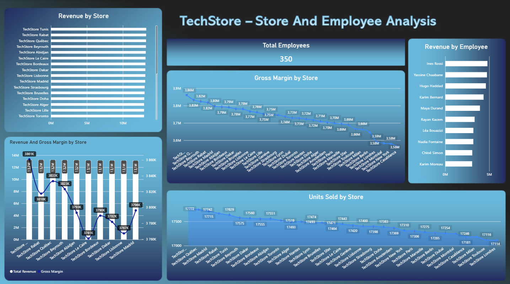
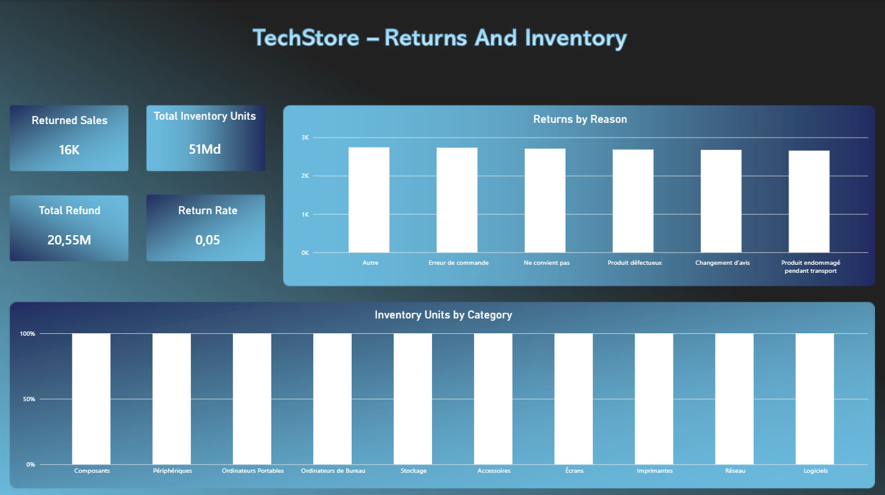

# TechStore - Enterprise Data Platform

End-to-end Business Intelligence and Data Engineering portfolio project for a technology retail dataset.
    
The repository demonstrates reproducible profiling, data cleaning, dimensional transformation, PostgreSQL warehousing, SQL analytics, and a Power BI dashboard asset.

> **Repository status:** The project pipeline, SQL analytics, warehouse validation, Power BI dashboard, and technical documentation are included. Generated RAW, SILVER, and GOLD CSV datasets are intentionally excluded from GitHub because of their size. The repository contains reproducible scripts to regenerate these layers locally.

## Overview

The platform moves transactional data through quality-controlled layers:



## Project Architecture
The platform follows a layered data architecture designed to separate data ingestion, quality control, transformation, warehousing, analytics, and visualization.

```
RAW
 │
 ▼
Python Profiling
 │
 ▼
SILVER — Cleaned & Validated Data
 │
 ▼
Python Transformation
 │
 ▼
GOLD — Dimensional Model
 │
 ▼
PostgreSQL Data Warehouse
 │
 ├── SQL Analytics
 │
 └── Power BI Semantic Model
       │
       ▼
   Interactive Dashboard
```

### Data Layers

- **RAW** — Original source dataset preserved without modification.
- **SILVER** — Cleaned, validated, and quality-controlled transactional data.
- **GOLD** — Dimensional data model containing fact and dimension tables.
- **Data Warehouse** — PostgreSQL `dw` schema used as the central analytical repository.
- **Analytics** — SQL queries and analytical views for business analysis.
- **BI Layer** — Power BI semantic model with relationships, DAX measures, filtering, and interactive dashboards.

## Data Warehouse

The PostgreSQL warehouse uses the `dw` schema and a dimensional model with **7 dimension tables** and **4 fact tables**. Dimension and fact tables use technical surrogate keys, including identity-generated keys where defined in the DDL, while foreign keys maintain referential integrity between related tables.

### Dimensions

- Customer — `dw.dw_dim_customer`
- Product — `dw.dw_dim_product`
- Supplier — `dw.dw_dim_supplier`
- Employee — `dw.dw_dim_employee`
- Store — `dw.dw_dim_store`
- Warehouse — `dw.dw_dim_warehouse`
- Date — `dw.dw_dim_date`

### Facts

- Sales — `dw.dw_fact_sales`
- Returns — `dw.dw_fact_returns`
- Payments — `dw.dw_fact_payments`
- Inventory — `dw.dw_fact_inventory`

| Type | Table | Purpose |
|---|---|---|
| Dimension | `dw.dw_dim_customer` | Customer descriptive attributes |
| Dimension | `dw.dw_dim_product` | Product descriptive attributes |
| Dimension | `dw.dw_dim_supplier` | Supplier descriptive attributes |
| Dimension | `dw.dw_dim_employee` | Employee descriptive attributes |
| Dimension | `dw.dw_dim_store` | Store descriptive attributes |
| Dimension | `dw.dw_dim_warehouse` | Warehouse descriptive attributes |
| Dimension | `dw.dw_dim_date` | Calendar and date attributes |
| Fact | `dw.dw_fact_sales` | Sales transactions |
| Fact | `dw.dw_fact_returns` | Returned sales and refunds |
| Fact | `dw.dw_fact_payments` | Payment transactions |
| Fact | `dw.dw_fact_inventory` | Inventory quantities and stock information |

The DDL is executed in this order:

1. `sql/warehouse/01_create_schema.sql`
2. `sql/warehouse/02_create_dimensions.sql`
3. `sql/warehouse/03_create_facts.sql`
4. `sql/warehouse/04_create_indexes.sql`

`05_quality_checks.sql` validates warehouse integrity. The recorded warehouse load audit reports PASS, matching Gold and warehouse row counts for all 11 tables and reporting zero orphaned foreign keys.

## Tech Stack

| Layer                 | Technologies      |
| --------------------- | ----------------- |
| Data Processing       | Python, Pandas    |
| Data Cleaning         | Python, Pandas    |
| Data Transformation   | Python            |
| Data Warehouse        | PostgreSQL        |
| SQL Analytics         | SQL, PostgreSQL   |
| Business Intelligence | Power BI          |
| Data Visualization    | Power BI          |
| Analytics             | DAX               |
| Documentation         | Markdown, Mermaid |
| Version Control       | Git, GitHub       |

## Business Context

The source represents technology retail or distribution transactions. It includes sales, customers, products, suppliers, employees, stores, warehouses, payments, returns, inventory-related fields, pricing, costs, discounts, shipping, and customer satisfaction.

The analytical model supports questions such as:

- How do revenue, cost, margin, and units sold trend over time?
- Which products, categories, customers, stores, and employees perform best?
- What is the return rate and refund exposure?
- How do payments reconcile with sales?
- How do inventory movements align with transactions?

## Project Objectives

- Profile a large transactional CSV without modifying the RAW layer.
- Apply explicit, auditable cleaning rules.
- Produce reusable dimensional and fact tables.
- Load the Gold layer into a PostgreSQL warehouse with surrogate keys and constraints.
- Provide reusable SQL views and domain analysis queries.
- Connect the warehouse to Power BI for semantic modeling and interactive analysis.

## Data Pipeline

| Layer     | Purpose                                   | Main implementation                                      |
| --------- | ----------------------------------------- | -------------------------------------------------------- |
| RAW       | Immutable source data                     | `data/raw/techstore_dataset.csv`                         |
| Profiling | Structural and missing-value analysis     | `src/quality/profile_dataset.py`                         |
| SILVER    | Cleaned, validated transaction data       | `src/cleaning/clean_dataset.py`                          |
| GOLD      | Dimensions and facts at documented grains | `src/transformation/split_into_tables.py`                |
| Warehouse | PostgreSQL relational model               | `sql/warehouse/`, `src/warehouse/load_datawarehouse.py`  |
| Analytics | Reusable views and analytical SQL         | `sql/analytics/`                                         |
| BI        | Power BI model and dashboard              | `powerbi/TechStore_Business_Intelligence_Dashboard.pbix` |

## Dataset

The verified profile report records **320,000 rows**, **58 columns**, and **0 exact duplicate rows**. The dataset contains `sale_date`, `delivery_date`, and `return_date` fields. Missing values are present in business-valid or imputable fields, including:

- `customer_age`: 3,129 missing values
- `shipping_cost`: 3,248 missing values
- `return_reason` and `return_date`: 303,808 missing values each, expected for non-returned sales
- `customer_satisfaction_score`: 113,821 missing values

The original and generated CSVs are intentionally excluded from the normal Git repository because they are approximately 156 MB and 160 MB respectively. Keep them locally under `data/raw/` and `data/silver/`, or regenerate them with the pipeline scripts.

## Data Profiling

`src/quality/profile_dataset.py` reads the unique CSV in `data/raw/` and writes:

- `docs/reports/dataset_profile.md`
- `docs/reports/dataset_profile.json`

Run it against a local source file with:

```powershell
python src/quality/profile_dataset.py --input data/raw/techstore_dataset.csv
```

## Data Cleaning

The cleaning script preserves legitimate NULLs and records its decisions in an audit. The verified run:

- retained all 320,000 rows;
- removed no exact duplicate rows or duplicate sale IDs;
- imputed 3,129 customer ages using the global median;
- imputed 3,248 shipping costs using the delivery-method median;
- found no invalid dates, identifiers, quantities, prices, returns, or financial calculations;
- passed the Silver quality checks.

```powershell
python src/cleaning/clean_dataset.py
```

See [`docs/reports/cleaning_report.md`](docs/reports/cleaning_report.md) and the JSON audits under `data/silver/`.

## Gold Layer

The transformation produces 11 logical tables:

| Type       | Tables                                                                                                                                              |
| ---------- | --------------------------------------------------------------------------------------------------------------------------------------------------- |
| Dimensions | `dim_customer` (24,999), `dim_product` (600), `dim_supplier` (60), `dim_employee` (350), `dim_store` (31), `dim_warehouse` (31), `dim_date` (1,854) |
| Facts      | `fact_sales` (320,000), `fact_returns` (16,192), `fact_payments` (320,000), `fact_inventory` (320,000)                                              |

The fact grains are documented in [`docs/reports/transformation_report.md`](docs/reports/transformation_report.md). The transformation quality audit reports PASS for primary keys, foreign keys, financial calculations, dates, returns, payments, inventory, and completeness.

## SQL Analytics

PostgreSQL is used for analytical SQL after the warehouse layer. The analytics scripts query the `dw` schema and provide reusable views, domain analysis, business KPIs, and SQL quality checks.

`sql/analytics/00_create_views.sql` creates these six reusable views:

- `analytics.vw_sales_kpis`
- `analytics.vw_monthly_sales`
- `analytics.vw_product_performance`
- `analytics.vw_customer_performance`
- `analytics.vw_store_performance`
- `analytics.vw_returns_analysis`

| Analysis Area | Description |
|---|---|
| Sales KPIs | Overall sales, revenue, cost, margin, quantity, order value, customer, product, and return metrics. |
| Sales trends | Yearly, quarterly, and monthly revenue, margin, quantity, sales counts, month-over-month, and year-over-year analysis. |
| Product analysis | Product, category, and brand performance, including revenue, margin, quantity, and returns. |
| Customer analysis | Customer revenue, margin, order value, return frequency, and value segments. |
| Store and employee analysis | Store rankings and employee sales, revenue, margin, quantity, and ranking analysis. |
| Returns analysis | Return rates, refunds, products, stores, customers, months, and return reasons. |
| Inventory analysis | Observed stock before and after sales, inventory events, quantities sold, and low-stock analysis. |
| Payment analysis | Payment amounts, methods, statuses, currencies, and payment-to-sale comparisons. |
| Business KPIs | Revenue and margin by sales channel, order status, and delivery method. |
| SQL quality checks | View presence, KPI validity, grain uniqueness, date coherence, reconciliation, payment, and inventory checks. |

The scripts `01_sales_kpis.sql` through `09_business_kpis.sql` cover the analysis areas documented above. `99_quality_checks.sql` validates the analytics layer; the existing report records **12/12 analytics checks PASS**.

The verified global KPI snapshot in [`docs/reports/sql_analytics_report.md`](docs/reports/sql_analytics_report.md) includes:

| KPI                 |          Value |
| ------------------- | -------------: |
| Total revenue       | 422,095,306.10 |
| Net revenue         | 400,147,824.80 |
| Total cost          | 284,682,045.70 |
| Gross margin        | 115,465,779.10 |
| Gross margin %      |       28.8558% |
| Quantity sold       |        540,337 |
| Number of sales     |        320,000 |
| Average order value |       1,250.46 |
| Customers           |         24,999 |
| Products sold       |            600 |
| Returned sales      |         16,192 |
| Return rate         |          5.06% |

## Power BI and DAX

The project includes an interactive Power BI dashboard built on top of the PostgreSQL `dw` data warehouse.

Power BI is used as the semantic and analytical layer of the platform, with relationships between dimensions and fact tables, DAX measures, filtering, cross-analysis, and time-intelligence calculations.

**Power BI file:** [`powerbi/TechStore_Business_Intelligence_Dashboard.pbix`](powerbi/TechStore_Business_Intelligence_Dashboard.pbix)

### Dashboard Pages

The dashboard contains six analytical pages:

1. **Executive Overview** — high-level business KPIs, revenue, margin, sales performance, and customer segmentation.
2. **Sales Analysis** — revenue trends, category performance, stores, customers, and top products.
3. **Product Analysis** — product, brand, category, pricing, revenue, and margin analysis.
4. **Customer Analysis** — customer-level and segment-level performance analysis.
5. **Store & Employee Analysis** — store and employee performance analysis.
6. **Returns & Inventory** — return analysis and inventory monitoring.

### Dashboard Preview

#### Executive Overview



#### Sales Analysis



#### Product Analysis



#### Customer Analysis



#### Store & Employee Analysis



#### Returns & Inventory



### DAX

The Power BI semantic model includes DAX measures for business KPIs, profitability, sales performance, returns, customer analysis, and time-based analysis.

Examples of analytical measures include:

- Total Revenue
- Total Cost
- Gross Margin
- Gross Margin %
- Quantity Sold
- Number of Sales
- Average Order Value
- Return Rate %
- Total Discount
- Total Refund
- Number of Customers
- Number of Products
- Sales Growth %
- Revenue YTD
- Revenue YoY %
- Margin YTD
- Margin YoY %

The PBIX remains the source for the complete Power BI semantic model, relationships, visuals, and DAX implementation.

## Data Quality & Validation

Data quality is checked throughout the pipeline, from RAW profiling and Silver cleaning through Gold transformation, warehouse loading, and SQL analytics.

| Layer | Quality Controls |
|---|---|
| RAW profiling | Dataset shape, column profiles, missing values, distinct values, and exact duplicate-row detection. |
| SILVER cleaning | Required fields, duplicate sale IDs, identifiers, date consistency, quantities, prices, discounts, returns, stock, satisfaction scores, and financial calculations. |
| GOLD transformation | Primary-key checks, foreign-key checks, financial consistency, quantity and inventory checks, date-key checks, return checks, payment checks, and completeness checks. |
| PostgreSQL warehouse | Table presence, Gold-to-warehouse row-count reconciliation, primary keys, foreign keys, orphan detection, surrogate keys, and warehouse quality checks. |
| SQL analytics | Analytical view presence, non-negative KPIs, division-by-zero protection, margin reconciliation, unique analytical grains, date coherence, monthly revenue reconciliation, payment reconciliation, and inventory reconciliation. |

The recorded Silver quality audit passed with zero reported issues across its duplicate, required-field, identifier, date, business-rule, and financial checks. The Gold transformation quality audit reports `passed: true` with zero reported issues across the listed primary-key, foreign-key, financial, quantity, date, return, payment, inventory, and completeness checks.

The warehouse load audit reports `status: PASS`, matching source and destination row counts for all 11 warehouse tables, with `pk_pass`, `fk_pass`, `surrogate_keys_pass`, and `quality_checks_pass` all true and zero foreign-key orphans. The warehouse SQL quality checks also recorded PASS for all six checks, while the SQL analytics report records **12/12 analytics checks PASS**.

The generated audits distinguish a data-quality **PASS** from implementation completeness. Audit files are retained as evidence, while large generated CSVs remain local.

## Technology Stack

Python, pandas, NumPy, PyArrow, SQLAlchemy, psycopg, PostgreSQL, SQL, Power BI, DAX, Git, and PowerShell.

## Project Structure

```text
techstore-enterprise-data-platform/
├── data/
│   ├── raw/                  # local, ignored source CSV
│   ├── silver/               # local, ignored cleaned CSV and audits
│   └── gold/                 # generated dimensions, facts, and audits
├── docs/
│   ├── reports/              # profiling, cleaning, transformation, DW, and SQL reports
│   └── data_dictionary.md
├── notebooks/                # reserved for reproducible notebooks
├── powerbi/                  # PBIX dashboard
├── sql/
│   ├── warehouse/            # PostgreSQL DDL and quality checks
│   └── analytics/            # views and analytical queries
├── src/
│   ├── quality/
│   ├── cleaning/
│   ├── transformation/
│   └── warehouse/
├── tests/
├── .env.example
├── .gitignore
├── README.md
└── requirements.txt
```

## Installation / Quick Start

From the repository root, use Python and a local PostgreSQL instance:

```powershell
python -m venv .venv
.\.venv\Scripts\Activate.ps1
python -m pip install -r requirements.txt
Copy-Item .env.example .env
```

The requirements file specifies pandas, NumPy, PyArrow, SQLAlchemy, psycopg, python-dotenv, and pytest. Python 3.12 is the recommended project environment. The dependency file itself does not declare a Python version constraint.

Do not commit `.env`. The example file contains placeholders only.

## Configuration

The warehouse loader reads `TECHSTORE_PG*` variables first and falls back to standard PostgreSQL environment variables. `.env.example` defines these local connection settings:

```text
TECHSTORE_PGHOST=localhost
TECHSTORE_PGPORT=5432
TECHSTORE_PGNAME=postgres
TECHSTORE_PGUSER=postgres
TECHSTORE_PGPASSWORD=your_password_here
```

Prepare a PostgreSQL database using the values configured above. The loader connects to PostgreSQL, executes the warehouse DDL files, and writes the warehouse load audit. No password is stored in this repository.

Run the pipeline in order:

1. Place the source CSV at `data/raw/techstore_dataset.csv`.
2. Run profiling, cleaning, and transformation:

```powershell
python src/quality/profile_dataset.py
python src/cleaning/clean_dataset.py
python src/transformation/split_into_tables.py
```

3. Load the PostgreSQL warehouse:

```powershell
python src/warehouse/load_datawarehouse.py
```

The warehouse loader uses a transactional truncate-and-reload strategy, loads dimensions before facts, resolves surrogate keys, uses PostgreSQL `COPY`, runs quality checks, and writes `data/gold/warehouse_load_audit.json`.

4. Run the SQL analytics views, analysis scripts, and quality checks with `psql`:

```powershell
psql -h localhost -p 5432 -U postgres -d postgres -f sql/analytics/00_create_views.sql
psql -h localhost -p 5432 -U postgres -d postgres -f sql/analytics/01_sales_kpis.sql
psql -h localhost -p 5432 -U postgres -d postgres -f sql/analytics/02_sales_trends.sql
psql -h localhost -p 5432 -U postgres -d postgres -f sql/analytics/03_product_analysis.sql
psql -h localhost -p 5432 -U postgres -d postgres -f sql/analytics/04_customer_analysis.sql
psql -h localhost -p 5432 -U postgres -d postgres -f sql/analytics/05_store_employee_analysis.sql
psql -h localhost -p 5432 -U postgres -d postgres -f sql/analytics/06_returns_analysis.sql
psql -h localhost -p 5432 -U postgres -d postgres -f sql/analytics/07_inventory_analysis.sql
psql -h localhost -p 5432 -U postgres -d postgres -f sql/analytics/08_payment_analysis.sql
psql -h localhost -p 5432 -U postgres -d postgres -f sql/analytics/09_business_kpis.sql
psql -h localhost -p 5432 -U postgres -d postgres -f sql/analytics/99_quality_checks.sql
```

The `psql` commands prompt for credentials when needed. Open the Power BI file after the warehouse and analytics layer are available:

[`powerbi/TechStore_Business_Intelligence_Dashboard.pbix`](powerbi/TechStore_Business_Intelligence_Dashboard.pbix)

Large/generated RAW, SILVER, and GOLD CSV files are intentionally excluded from GitHub by the repository configuration. Obtain or regenerate the source data locally before running the pipeline.

## Documentation

- [`docs/data_dictionary.md`](docs/data_dictionary.md) - source and analytical field definitions
- [`docs/reports/dataset_profile.md`](docs/reports/dataset_profile.md) - profiling evidence
- [`docs/reports/cleaning_report.md`](docs/reports/cleaning_report.md) - cleaning audit and decisions
- [`docs/reports/transformation_report.md`](docs/reports/transformation_report.md) - Gold tables and grains
- [`docs/reports/data_warehouse_design.md`](docs/reports/data_warehouse_design.md) - warehouse design
- [`docs/reports/warehouse_load_report.md`](docs/reports/warehouse_load_report.md) - PostgreSQL load evidence
- [`docs/reports/sql_analytics_report.md`](docs/reports/sql_analytics_report.md) - views, checks, and KPI snapshot

## Data Availability

Large CSV files are excluded by `.gitignore` to keep a normal Git repository usable. The repository does not currently declare an external download URL. Obtain or regenerate the source data locally before running the pipeline.

## GitHub Repository Guidelines

Suggested repository name: `techstore-enterprise-data-platform`

Suggested description: `End-to-end Business Intelligence and Data Engineering platform built with Python, PostgreSQL, SQL, Power BI and DAX.`

Suggested topics: `python`, `pandas`, `sql`, `postgresql`, `data-warehouse`, `etl`, `data-engineering`, `business-intelligence`, `power-bi`, `dax`, `data-analytics`

This preparation intentionally does not add a Git remote, create a repository, commit changes, or push data.

## Future Improvements

- Add automated tests for pipeline contracts and SQL quality checks.
- Add a documented, privacy-safe data acquisition or generation process.
- Export verified Power BI screenshots and a DAX measure catalog.
- Add orchestration and incremental loading when a real refresh requirement exists.
- Add CI for Python checks and SQL validation.

## Author

TechStore portfolio project. Add your preferred author, portfolio, and LinkedIn details before publication.
