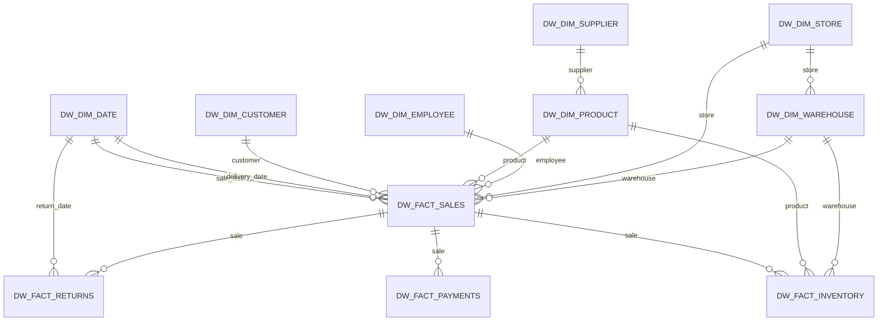

# TechStore - Data Warehouse Design

## 1. Objectif

Cette étape transforme les 11 tables Gold validées en un modèle dimensionnel destiné à l'analyse SQL et à une future couche Power BI. Le périmètre reste conceptuel et SQL : aucune base de données réelle ni chargement n'est exécuté à ce stade.

Flux cible :

```text
RAW -> Silver -> Gold -> Data Warehouse -> SQL Analytics -> Power BI
```

Les données RAW et Silver restent immuables. Les CSV Gold restent la source de préparation du Data Warehouse et ne sont pas remplacés.

## 2. Architecture Star Schema

Le schéma PostgreSQL cible est `dw`. Les dimensions décrivent les axes d'analyse et les facts conservent les mesures au grain transactionnel.



`dw_fact_sales` est le fact principal. Les facts retours, paiements et inventaire sont des facts satellites reliés à la vente par `sales_key`, tout en conservant `sale_id` pour la traçabilité métier.

## 3. Grains vérifiés dans Gold

Les grains ont été vérifiés sur les CSV Gold existants :

| Table Gold       | Grain                                                               | Lignes vérifiées |
| ---------------- | ------------------------------------------------------------------- | ---------------: |
| `fact_sales`     | une ligne par vente, identifiée par `sale_id`                       |          320 000 |
| `fact_returns`   | une ligne par vente retournée                                       |           16 192 |
| `fact_payments`  | une ligne de paiement par vente                                     |          320 000 |
| `fact_inventory` | une ligne de mouvement/état de stock par vente, produit et entrepôt |          320 000 |

Les dimensions sont au grain d'une entité métier : client, produit, fournisseur, employé, magasin, entrepôt et date calendrier.

## 4. Tables du Data Warehouse

### Dimensions

| Table DW           | Clé primaire    | Business key    | Relations principales                                                      |
| ------------------ | --------------- | --------------- | -------------------------------------------------------------------------- |
| `dw_dim_customer`  | `customer_key`  | `customer_id`   | référencée par `dw_fact_sales`                                             |
| `dw_dim_product`   | `product_key`   | `product_id`    | `supplier_key` vers `dw_dim_supplier`; référencée par ventes et inventaire |
| `dw_dim_supplier`  | `supplier_key`  | `supplier_id`   | référencée par `dw_dim_product`                                            |
| `dw_dim_employee`  | `employee_key`  | `employee_id`   | référencée par `dw_fact_sales`                                             |
| `dw_dim_store`     | `store_key`     | `store_id`      | référencée par ventes; parent de `dw_dim_warehouse`                        |
| `dw_dim_warehouse` | `warehouse_key` | `warehouse_id`  | `store_key` vers `dw_dim_store`; référencée par ventes et inventaire       |
| `dw_dim_date`      | `date_key`      | `calendar_date` | référencée par les dates de vente, livraison et retour                     |

`dw_dim_date.date_key` conserve la clé calendrier `YYYYMMDD` de Gold : elle est stable, lisible et adaptée aux jointures de dates. Les autres dimensions utilisent une clé technique `IDENTITY`.

### Facts

| Table DW            | Clé primaire    | Grain                                | Relations                                    |
| ------------------- | --------------- | ------------------------------------ | -------------------------------------------- |
| `dw_fact_sales`     | `sales_key`     | une ligne par vente                  | cinq dimensions métier et deux rôles de date |
| `dw_fact_returns`   | `return_key`    | une ligne par vente retournée        | `sales_key`, `return_date_key`               |
| `dw_fact_payments`  | `payment_key`   | un paiement par vente                | `sales_key`                                  |
| `dw_fact_inventory` | `inventory_key` | un état/mouvement de stock par vente | `sales_key`, produit, entrepôt               |

Les `sale_id` restent uniques dans les quatre facts concernés. Ils servent de business key et permettent l'audit Gold -> DW; les relations analytiques utilisent les clés techniques.

## 5. Surrogate keys

Les clés `customer_key`, `product_key`, `supplier_key`, `employee_key`, `store_key` et `warehouse_key` sont générées par PostgreSQL. Elles découplent le modèle analytique des identifiants opérationnels, permettent de conserver plusieurs versions historiques d'une dimension si une stratégie SCD est introduite plus tard, et stabilisent les jointures des facts.

Les business keys Gold (`customer_id`, `product_id`, etc.) sont conservées avec une contrainte `UNIQUE`. Aucun changement de business key n'est simulé dans cette étape. Une future stratégie SCD Type 2 pourra ajouter `valid_from`, `valid_to` et `is_current` sans modifier les facts historiques.

Les clés des facts sont également techniques (`sales_key`, `return_key`, `payment_key`, `inventory_key`), tandis que `sale_id` reste une clé métier unique de traçabilité.

## 6. Scripts SQL

Les scripts sont exécutés dans l'ordre suivant sur PostgreSQL :

1. `sql/warehouse/01_create_schema.sql` crée le schéma `dw`.
2. `sql/warehouse/02_create_dimensions.sql` crée les sept dimensions et leurs contraintes.
3. `sql/warehouse/03_create_facts.sql` crée les quatre facts et leurs contraintes référentielles.
4. `sql/warehouse/04_create_indexes.sql` ajoute les index de jointure et de filtrage.
5. `sql/warehouse/05_quality_checks.sql` prépare les contrôles de comptage, unicité, montants, intégrité et inventaire.

Le chargement Gold vers les tables DW n'est pas exécuté maintenant, conformément au périmètre de conception de l'étape 4.

## 7. Choix techniques

- Dialecte cible : PostgreSQL, cohérent avec les dépendances du projet.
- Schéma séparé : `dw` isole le modèle dimensionnel des schémas opérationnels et analytiques.
- Types monétaires : `NUMERIC(18,2)` pour éviter les erreurs binaires de `FLOAT`.
- Pourcentages : `NUMERIC(9,6)` afin de conserver les ratios Gold compris entre 0 et 1.
- Identifiants : `BIGINT GENERATED ALWAYS AS IDENTITY` pour les clés techniques.
- Nullabilité : clés et attributs nécessaires aux jointures en `NOT NULL`; les scores de satisfaction restent nullable car leur absence est légitime.
- Contraintes : `PRIMARY KEY`, `UNIQUE`, `FOREIGN KEY` et contrôles métier simples sur quantités, stocks, remises et montants.

## 8. Stratégie d'indexation

Les clés primaires et contraintes `UNIQUE` créent les index d'identification. Des index supplémentaires sont prévus sur :

- les clés étrangères de `dw_dim_product` et `dw_dim_warehouse`;
- les deux rôles de date de `dw_fact_sales`;
- les clés de dimensions de `dw_fact_sales`;
- les clés de liaison et de date de `dw_fact_returns`;
- les clés de liaison de paiements et d'inventaire.

Ces index ciblent les jointures Star Schema et les filtres temporels récurrents. Une optimisation par partitionnement ou index composites sera évaluée après observation des requêtes SQL Analytics réelles.

## 9. Contrôles prévus

`05_quality_checks.sql` couvrira les contrôles suivants après chargement :

- 320 000 lignes dans `dw_fact_sales`;
- unicité de `sale_id` et absence de doublons;
- validité des FK, renforcée par les contraintes PostgreSQL;
- cohérence `gross_amount`, remise, net, coût et marge;
- cohérence des paiements avec `net_amount`;
- cohérence des retours avec les ventes;
- cohérence `stock_after_sale = stock_before_sale - quantity_sold`;
- cohérence des quantités et des relations produit/entrepôt;
- validité des clés de date et conservation des relations de dates.

La conservation des 320 000 ventes et la qualité des 11 tables Gold ont déjà été validées à l'étape 3. Le chargement DW devra rejouer ces contrôles au niveau cible.

## 10. Statut

**STEP 4 DESIGN STATUS: PASS**

L'architecture, les tables cibles, les contraintes, les index et les contrôles SQL sont définis. Aucun dashboard Power BI, DAX, modèle ML ou base de données réelle n'a été construit dans cette étape.
